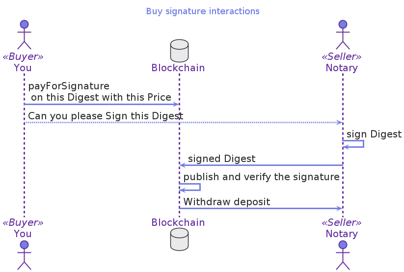
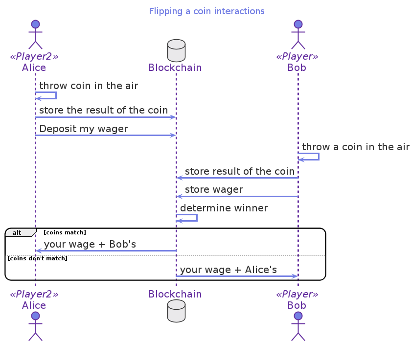
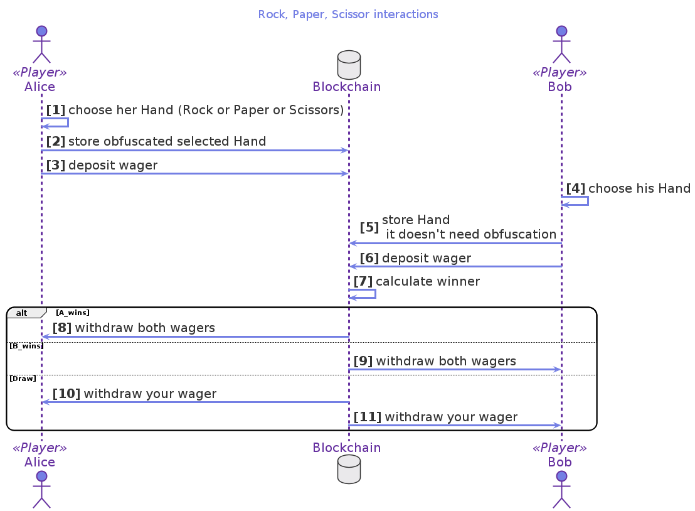
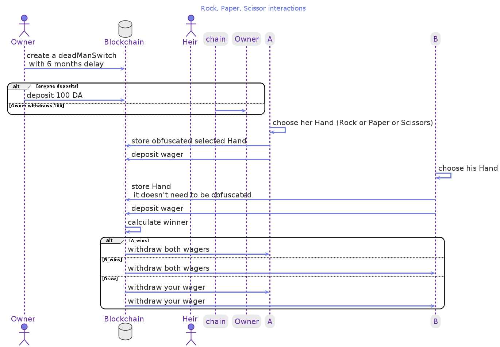
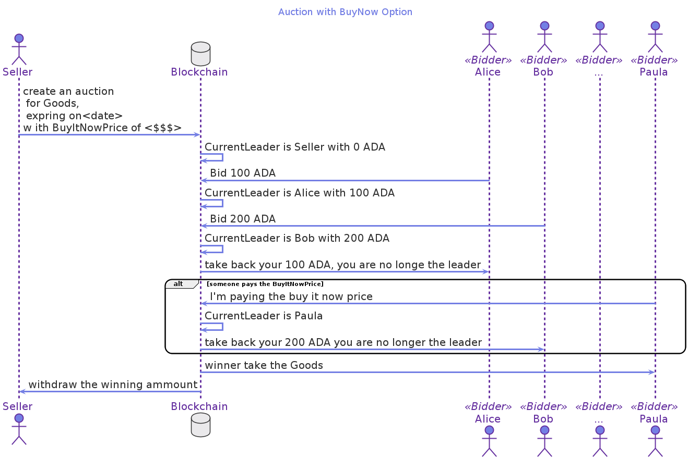
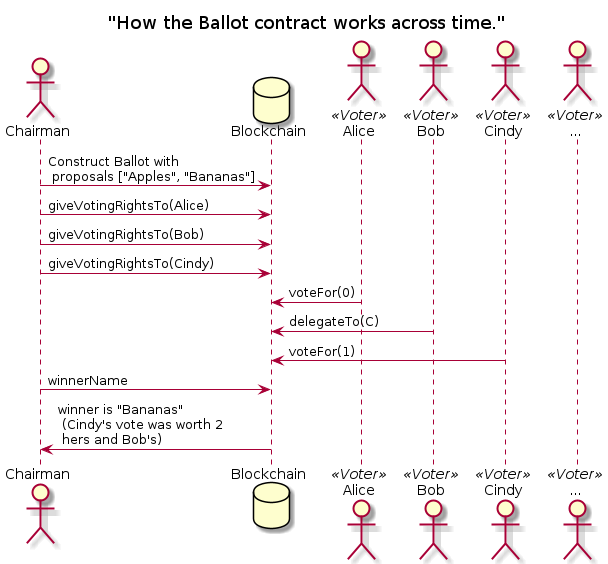

# Glow Tutorial

Glow is a language for developing secure decentralized apps (DApps) that can run on different blockchains.

In this tutorial, we analyze the sample programs that are provided in the Glow distribution to learn
how they work, and how could they can be applied to smart contract and DApp development.

# Buy Signature ([buy_sig.glow](https://gitlab.com/mukn/glow/-/blob/master/future/buy_sig.glow))?

Let's imagine you want to have your testament notarized. What would you do?

> You first write your testament
> You pay a notary to stamp it
> You store a copy for future reference

If you think about it, there are many interactions in the world that follow that same process:

-   When your diploma is certified by your University.
-   When you renew your driver's license, there is no test, just a renewal stamp.

We could generalize the  process as:

> A buyer (you in this case)
> Pays a seller
> Takes something, or better yet, a representation of the item (a digest) to a seller.
> The seller can now sign the digest.
> All parties can see that the digest was signed.

This is the interaction that the `buy_sig.glow` contract represents.

## Visualizing the Buyer and Seller interactions

## Glow code

    1    #lang glow
    2    @interaction([Buyer, Seller])
    3    let payForSignature = (digest : Digest, price : Assets) => {
    4      deposit! Buyer -> price;
    5      @verifiably!(Seller) let signature = sign(digest);
    6      publish! Seller -> signature;
    7      verify! signature;
    8      withdraw! Seller <- price;
    9    }

2.  Buyer and seller have agreed to the terms of this sale. They both know what the signature is about, and they want to conduct this sale.
3.  The digest of the message to sign is a parameter of the interaction, as is the convened price.
4.  The buyer deposits the money according to the price.
5.  The seller signs, but it is private only to the seller.
6.  The signature is made public for everyone to see.
7.  The signature is verified by everyone in a way that the contract enforces.
8.  Finally, the money is transferred to the seller.

There are several things to note:

1.  The code looks a lot like the sequence diagram we created before.
2.  The lines of code with @Seller annotation are private.
3.  The language itself takes care of requirements. If the buyer never deposits, then the seller never will be able to sign.

## Lessons learned

-   Identify the participants of a contract with `@interaction`

When an instruction is annotated with the participant's name, that value is private for the participant. Like `@verifiably!(Seller)`

-   There are clear instructions for `deposit!` and `withdraw!`

# How can you flip a coin in Glow? (coinflip.glow)

Flipping a coin is a game as old as, well, coins.
Alice throws the coin *in the air*,
Bob calls whatever he thinks is going to be the outcome.
The loser pays the winner the agreed amount.

However, on blockchain, there is no such thing as *in the air*.
So, how can we have something random that has a 50 / 50 chance for Alice?

For example, Alice flips her coin.
Bob flips his coin
And then Alice wins if both coins match.
Or Bob wins if the coins are different.
Both outcomes have a 50 / 50 chance of happening.

## Sequence diagram

## Glow code

The following Glow code exmaple represents the previous interaction:

     1  #lang glow
     2  @interaction([A, B])
     3  let coinFlip = (wagerAmount) => {
     4      @A assert! canReach(A_wins);
     5      @A let randA = randomUInt256();
     6      @verifiably!(A) let commitment = digest(randA);
     7      publish! A -> commitment; deposit! A -> wagerAmount;
     8      @B assert! canReach(B_wins);
     9      @B let randB = randomUInt256();
    10      publish! B -> randB; deposit! B -> wagerAmount;
    11      publish! A -> randA;
    12      verify! commitment;
    13      if (((randA ^^^ randB) &&& 1) == 0) {
    14          A_wins: withdraw! A <- 2*wagerAmount
    15      } else {
    16          B_wins: withdraw! B <- 2*wagerAmount
    17      }
    18  };

1.  Every Glow program starts with the #lang glow identification
2.  We know that two actors, A and B (Alice and Bob), are going to participate in this contract
3.  coinFlip needs to know the amount each player is going to bet to get started.
4.  Alice needs to be assured that there is a state where she can win. Ie. `assert!` makes sure that the program can reach the label `A_wins`
5.  Alice draws random numbers between 0 and 2256. Approx. 78 decimal digits.
6.  Alice stores in the commitment value the digest of the random number she generated.
7.  She publishes her commitment on the blockchain and deposits her wager.

Now it is Bob's turn:

8.  Bob makes sure that it is possible to get to the `B_wins` label to know that he can win.
9.  Bob flips a coin. i.e., draws a random number between 0 and 2256.
10. Bob publishes the coin that he flipped and deposits his wager.
11. Alice publishes the coin that she threw.
12. We `verify!` that the commitment matches the coin that she threw.
13. By doing a bitwise XOR of the random numbers thrown by Alice and Bob, we find that they match
14. Alice wins and withdraws two times the wager
15. However, If the `xor` doesn't match, Bob wins
16. In addition, Bob gets double the bet.

## Lessons learned

-   You can generate random numbers with `randomUInt256`
-   You can `assert!` you can reach a label such as `A_wins:`
-   There are bitwise operations with like `^^^` and `&&&`

# Playing Rock, Paper, Scissors (rps-min.glow)?

Rock, paper, scissors is the classic children's game where each child shows what they have chosen at the same time.
The decision on who has won is based on the following rules:

-   Both selected the same: Draw
-   Rock beats scissors
-   Paper beats rock
-   Scissors beats paper

How con you code this in Glow if there is no *at the same time*.
How does a player communicate their choice to the blockchain during the game?

## Visualization

## Glow code

     1  #lang glow
     2  data Hand = | Rock | Paper | Scissors;
     3  data Outcome = | B_Wins | Draw | A_Wins;
     4  let winner = (handA : Hand, handB : Hand) : Outcome => {
     5      Outcome.ofNat((Hand.toNat(handA) + (4 - Hand.toNat(handB))) % 3) }
     6
     7  @interaction([A, B])
     8  let rockPaperScissors = (wagerAmount) => {
     9      @A assert! canReach(end, end.outcome == A_Wins);
    10      @A let handA = Hand.input("First player, pick your hand");
    11      @A let salt = randomUInt256();
    12      @verifiably!(A) let commitment = digest([salt, handA]);
    13      publish! A -> commitment; deposit! A -> wagerAmount;
    14
    15      @B assert! canReach(end, end.outcome == B_Wins);
    16      @B let handB = Hand.input("Second player, pick your hand");
    17      publish! B -> handB; deposit! B -> wagerAmount;
    18
    19      publish! A -> salt, handA;
    20      verify! commitment;
    21      let outcome = winner(handA, handB);
    22    end: switch(outcome) {
    23        | A_Wins => withdraw! A <- 2*wagerAmount
    24        | B_Wins => withdraw! B <- 2*wagerAmount
    25        | Draw => withdraw! A <- wagerAmount; withdraw! B <- wagerAmount }}

2.  A `Hand` can only be `Rock, Paper or Scissors`
3.  There are only three possible `Outcome` either `B_wins`, `A_wins`, or its a `Draw`
4.  Now define a function `winner`, that when given two hands can determine the `Outcome`
5.  This is an arithmetic trick that translates each of the nine possible hand combinations to three possible outcomes
6.

7.  Alice and Bob use this contract
8.  Declare the `rockPaperScissors` contract that has the `wagerAmount`
9.  `@Alice` makes sure (`assert!`) that it's possible to reach the `end:` label
10. `@Alice` asks (`input`) and stores the value of her Hand.
11. `@Alice` creates a random value (`salt`) that will be used to obfuscate her Hand
12. `@Alice` store the obfuscated value of her Hand in a `verifiably` commitment
13. `@Alice` makes her commitment public and `deposit!` her wage.
14.

15. `@Bob` makes sure he can reach the `end.outcome` where he wins
16. `@Bob` can `input` what hand he chooses to play
17. `@Bob` publishes his Hand and deposits his wager
18.

19. Now it's possible to publish the `salt` and in the next step, use it to
20. `verify!` that the `commitment` was obfuscated with the salt
21. now we calculate the `outcome` as the result of evaluating the `winner` function with both hands.
22. `switch` for pattern matching, it's possible to select the appropriate outcome.
23. if `outcome` is `A_wins` `withdraw` to Alice both wages.
24. if `outcome` is `B_wins` `withdraw` to Bob both wages.
25. if `outcome` is `Draw` `withdraw` to give back their money to Alice and Bob.

## Lessons learned

-   You can define your data types with `data Hand`
-   You can define smaller functions that are used later in the contract. Like: `let winner = (handA:Hand, handB:Hand)`
-   You can use `switch` to do pattern matching

# How to create a deadman switch?

Let's suppose a millionaire unlce has called you because he will give you the password to all his fortune.
However, while you are traveling to see your relative he passes away, and only he knew the password for the safe!

Six months later, you get an email with the password for the safe and it turns out that your uncle had a *dead man switch* that would automatically reveal the password.

In this contract, we are going to see how your uncle implemented that contract in Glow.

## Visualization

## Glow Code

     1  #lang glow
     2  // -*- JavaScript -*-
     3  // Inspired by https://github.com/KarolTrzeszczkowski/Electron-Cash-Last-Will-Plugin
     4
     5    data Command = Withdraw(x : Nat) | Inherit(x : Nat)
     6
     7    @interaction([Owner, Heir])
     8    let deadManSwitch = (expirationDelay) => {
     9      let rec loop = (expirationTimestamp) =>
    10        choice {
    11        | @_ deposit! x ;
    12        loop (expirationtimestamp);
    13        | @owner publish! withdraw(x);
    14        withdraw! owner <- x ;
    15        loop (now() + expirationdelay);
    16        | @heir publish! inherit(x);
    17        require! now() >= expirationtimestamp;
    18        withdraw! heir <- x;
    19      };
    20      loop(now() + expirationdelay);
    21    }

-   5 on this contract, there are only two actions, either withdraw or inherit.
-   7 and there are only two participants, the Owner of the fortune and you.
-   8 When creating the contract, the Owner must say how often he wants it to renew. For example, every six months.
-   20 The first time we go into the loop, it starts
-   9 Now the `loop` is a function that can call itself (recursive).
-   10 Is like pattern matching but based on whom performs the action
-   11 If there is a deposit, the contract continues.
-   13 In order to show that it's still alive, the Owner publishes on the blockchain that he wants to withdraw a little bit of the funds in the contract.
-   15 It renews the *dead man switch* with a new deadline.
-   16 When the `@heir` signals on the blockchain that is ready to inherit.

The contract checks if the current block is past the expiration day.
If this is the case, the funds are released to the `heir`.

## Lessons learned

-   How to use explicit timestamps
-   How to use recursive functions

# How does the Simple Auction (auction.glow) contract work?

Imagine an auction where each one of the bidders tries to outbid the previous bidder.
However, in a blockchain auction, each bidder has to declare the money first to become the top bidder.
They get their money back when they are outbid.

## Visualization

## Glow code

     1  #lang glow
     2  data Action = Bid(TokenAmount) | BuyItNow | Close;
     3
     4  @interaction([Seller])
     5  let simpleAuction = (goods : Assets, expirationTime : Timestamp, buyItNowPrice: TokenAmount) => {
     6     require! Assets.is_positive(goods);
     7     require! expirationTime > currentTime();
     8     deposit! Seller -> goods;
     9
    10     @interaction([Seller, CurrentBidder])
    11     let rec auction = (currentBid) => {
    12       assert! @deposited == goods + currentBid;
    13       choice {
    14         | ForAllParticipant (NewBidder) {
    15             @NewBidder bid = Bid(input(["Enter next bid"], TokenAmout));
    16             publish! NewBidder -> bid ; deposit! NewBidder -> bid;
    17             @NewBidder assume! @value(goods) > @value(bid);
    18             require! currentTime() < expirationTime;
    19             require! bid > currentBid;
    20             require! bid < buyItNowPrice;
    21             withdraw! CurrentBidder <- currentBid;
    22             @interaction([Seller, NewBidder]) auction(bid);
    23         | ForAllParticipant (NewBidder) {
    24             publish! NewBidder -> BuyItNow ; deposit! NewBidder -> buyItNowPrice;
    25             require! currentTime() < expirationTime;
    26             withdraw! NewBidder <- goods;
    27             withdraw! CurrentBidder <- currentBid;
    28             withdraw! Seller <- buyItNowPrice;
    29        | @_ { publish! Close; } =>
    30           require! currentTime() >= expirationTime;
    31           withdraw! Seller <- currentBid;
    32           withdraw! CurrentBidder <- goods;
    33       };
    34     @interaction([Seller, Seller]) auction(0);
    35  }

-   2 Declares the possible commands that could be performed on this contract
-   4 Only the Seller can create an auction
-   **5:** In order to create an auction, a Seller must provide:

The `Goods` that could be anything that can be represented as an asset,
an `expirationTime` at which point the auction is over and
a price at which to buy it immediately `buyItNowPrice`.

-   8 The Seller must deposit the goods in the smart contract. This could, for example, a photograph.
-   34 The real auction begins at 0, and the "first bidder" is the Seller himself.
-   10 The real auction is an interaction between the Seller and the Current bidder.
-   11 This function is recursive, so it can call itself.
-   12 A sanity check, let's make sure that the amount deposited to the contract is the goods plus the current bidder.
-   14 This is key in this contract; anyone that bids may become a participant.
-   15 The contract as the new participant for their bid.
-   16 The new bid should be public and it's deposited into the contract.
-   19 The new bid must be bigger than the current one in order to replace it.
-   21 The previous highest bidder gets its money back since it has been replaced by the new bid.
-   22 Now the auction may continue, recursively, with a new highest bidder.
-   23 If the new bidder, reaches the *buy it now* price. Then the auction is settled right now.
-   29 If the expiration time is reached, then the auction is settled.

## Lessons learned

-   Recursive function definitions
-   How to involve participants that are not known beforehand.
-   How to use an expiration date

# How does Crowdfunding.glow work?

In this day and age, crowdfunding campaigns are well known.
Platforms like kickstarter.com and GoFund.me have made the crowdfunding model well known across the world
as an excellent way to bring together the resources of several parties that do not know each other
and yet are willing to contribute some money towards a common goal.

## Glow code

     1  data Action = Pledge(TokenAmount) | Close | Reclaim(TokenAmount);
     2
     3  let platformCommission amount = quotient(amount, 100);
     4
     5  @interaction
     6  let crowdfunding = (target: TokenAmount,
     7                      expirationTime : Timestamp) => {
     8     require! expirationTime > currentTime();
     9
    10     let rec crowdfund = (ledger : Table(TokenAmount <- Participant),
    11                          totalPledged: TokenAmount) => {
    12       assert! totalPledged == totalAmount(ledger);
    13       choice {
    14         | ForAllParticipant (NewPledger) {
    15             @NewPledger amount =
    16               input(["Enter next pledge"], TokenAmount);
    17             publish! NewPledger -> Pledge(amount);
    18             deposit! NewPledger -> amount;
    19             require! currentTime() < expirationTime;
    20             crowdfund(Table.add(ledger, NewPledger, amount),
    21                       totalPledged + amount);
    22
    23         | publish! Organizer -> Success;
    24             require! currentTime() >= expirationTime;
    25             require! totalPledged >= target;
    26             let commission = platformCommission(totalPledged);
    27             withdraw! Platform <- commission;
    28             withdraw! Organizer <- totalPledged - commission;
    29
    30         | ForAllParticipant(Pledger)
    31             publish! Pledger -> Reclaim(amount);
    32             require! currentTime() >= expirationTime;
    33             require! totalPledged < target;
    34             require! Table.get(ledger, Pledger) == amount;
    35             withdraw! Pledger <- amount; //(ref: return_amount_to_pledger)
    36             crowdfund(Table.remove(ledger, Pledger), //(ref: remove_pledger_from_ledger)
    37                       totalPledged - amount);
    38     }
    39     crowdfund({}, 0);
    40  }

-   7 When creating a campaign, there is a goal and an expiration time.

-   11 We create a `ledger` where we record the `Pledgers` and the total amoun the campaign has raised so far

Now three things can happen:

-   There is a new pledge
-   The campaign was a successor
-   A pledger reclaims a refund

Let's look at all three in detail.

### Dealing with a new pledge

Any participant can pledge 14.
The `NewPledger` must `deposit!` her amount to the contract 18.
And the pledge is stored in the `Ledger` 20.

### Campaign is successful

23 When the organizer declares the campaign a success.
24 We must make sure the deadline for the campaign has passed and
25 The `totalPledged` surpassed the `target`.

### Pledger requests a reimbursement

When a pledger requests a reimbursement 30.
We check that the expiration date has passed 32 and
that the goal wasn't achieved  33 .
Then we check that the amount that is reclaiming is the same we have stored in the Ledger 34.
We return the amount to the Pledger and remove it from the Ledger.

## Lessons learned

-   Explicit timeout
-   Unrestricted open set of participants
-   Choice restricted to timeouts and open participation

## Challenge

Can you write a version of this contract that does the following:
a) Automatically decides if the campaign was successful or not (given the timeout).
b) Reimburses all the pledges automatically.

# Challenge: Translate a Solidity smart contract to Glow

In order to learn something new, we normally try to learn it refers to something we already know.
That's why in this article, we are going to learn the Glow smart contract language
by studying an example in Solidity and then translating it to Glow

## The Ballot example

Ballot.sol is the first program that loads when looking going to the Remix IDE

    pragma solidity >=0.7.0 <0.8.0;
    contract Ballot {

Declare a struct called Voter that is a complex type
consisting of the weight of a vote, a Boolean voted,
the address of the Voter, and an index called vote.

    struct Voter {
        uint weight;// Weight is accumulated by delegation
        bool voted; // if true, that person already voted
        address delegate;// person delegated to
        uint vote;  // index of the voted proposal
    }

You have an address type called chairperson.

    address chairperson;

You have a mapping where you map and address with a voter

    mapping(address => Voter) voters;

You also create an array of proposals where each proposal is a complex type struct.

     Proposal[] proposals;

     struct Proposal {
    // If you can limit the length to a certain number of bytes,
    // always use one of bytes1 to bytes32 because they are much cheaper
         bytes32 name;  // short name (up to 32 bytes)
         uint voteCount;// number of accumulated votes
     }

In the constructor Ballot, you initialize the chairperson as the message sender with weight 1.
You also create a list of proposals.

    constructor(bytes32[] memory proposalNames) {
        chairperson = msg.sender;
        voters[chairperson].weight = 1;

        for (uint i = 0; i < proposalNames.length; i++) {
       // 'Proposal({...})' creates a temporary
       // Proposal object and 'proposals.push(...)'
       // appends it to the end of 'proposals'.
            proposals.push(Proposal({
                name: proposalNames[i],
                voteCount: 0
            }));
        }
    }

Give the `Voter` the right to vote on this ballot.
It can only be called by the `Chairperson`.
Validate that the voters have not voted yet and assign voters a weight.

    function giveRightToVote(address voter) public {
        require(
            msg.sender == chairperson,
            "Only chairperson can give right to vote."
        );
        require(
            !voters[voter].voted,
            "The voter already voted."
        );
        require(voters[voter].weight == 0,
                "the voter already had voting rights");
        voters[voter].weight = 1;
    }

Then the delegate() function delegates your vote to the Voter $(to) after a couple of validations
such as the message sender is not the to address has not voted.

    function delegate(address to) public {
        Voter storage sender = voters[msg.sender];
        require(!sender.voted, "You already voted.");
        require(to != msg.sender, "Self-delegation is disallowed.");

        while (voters[to].delegate != address(0)) {
            to = voters[to].delegate;

           // We found a loop in the Delegation, not allowed.
            require(to != msg.sender, "Found loop in delegation.");
        }
        sender.voted = true;
        sender.delegate = to;
        Voter storage delegate_ = voters[to];
        if (delegate_.voted) {
           // If the delegate already voted,
           // directly add to the number of votes
            proposals[delegate_.vote].voteCount += sender.weight;
        } else {
           // If the delegate did not vote yet,
           // add to her weight.
            delegate_.weight += sender.weight;
        }
    }

Give your vote (including votes delegated to you) to proposal

    function vote(uint proposal) public {
        Voter storage sender = voters[msg.sender];
        require(sender.weight != 0, "Has no right to vote");
        require(!sender.voted, "Already voted.");
        sender.voted = true;
        sender.vote = proposal;

       // If 'proposal' is out of the range of the array,
       // this will throw automatically and revert all
       // changes.
        proposals[proposal].voteCount += sender.weight;
    }

Find which is the proposal with the most votes.

    function winningProposal() public view
            returns (uint winningProposal_)
    {
        uint winningVoteCount = 0;
        for (uint p = 0; p < proposals.length; p++) {
            if (proposals[p].voteCount > winningVoteCount) {
                winningVoteCount = proposals[p].voteCount;
                winningProposal_ = p;
            }
        }
    }

Get the name of the winning proposal

     function winnerName() public view
                 returns (bytes32 winnerName_)
         {
             winnerName_ = proposals[winningProposal()].name;
         }
    }

## Visualization

By reading the previous contract, we can identify the following actors and flow:
The `Chairman` creates a contract with a defined number of options.
Then gives names to each option.
And grants voting rights to voters.
A voter (Bob in this diagram) can delegate his vote to another voter.
Voters vote for one of the options by its number.
Then everyone can ask who is winning by the one that has more votes.

## How does the contract look in Glow?

Now it is your turn. How does the previous smart contract look in Glow?

Here are a few ideas on how you could get started with such a program:

-   One known proposal, one known voter
-   Multiple known proposals, One known voter
-   Multiple known proposals, Three known voters
-   Multiple known proposals, Three known voters, with delegation
-   Multiple known proposals, unknown voters, with delegation
-   Multiple known proposals, unknown voters, with delegation, with giving voting rights
